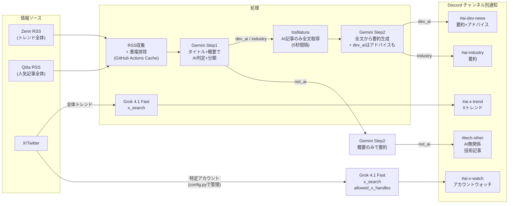

# AI News Discord 通知システム - 完全設計書

## アーキテクチャ概要



---

## コスト試算（月額・詳細）

### Grok 4.1 Fast + x_search（1日2回: トレンド1回 + アカウントウォッチ1回）

1リクエストあたりの内訳:

- **入力トークン**: ~1,000 tokens x $0.20/1M = **$0.0002**
- **出力トークン**: ~3,000-5,000 tokens x $0.50/1M = **$0.0015 - $0.0025**
- **x_search ツール呼び出し**: 2-5回（モデルが自律的に検索） x $0.005 = **$0.01 - $0.025**
- **1リクエスト合計: ~$0.012 - $0.028**

1日2リクエスト x 30日:

- **楽観ケース**: $0.012 x 2 x 30日 = **$0.72/月**
- **悲観ケース**: $0.028 x 2 x 30日 = **$1.68/月**

### 全体コストまとめ

- **Gemini 2.5 Flash（記事分類+要約）**: **$0**（Free Tier: 250リクエスト/日、使うのは最大21回/日）
- **Grok 4.1 Fast + x_search（トレンド + アカウントウォッチ）**: **$0.72 - $1.68/月**
- **GitHub Actions（パブリックリポジトリ）**: **$0**
- **Discord Webhook**: **$0**
- **合計: 約 $0.72 - $1.68/月（約110 - 260円/月）**

### 無料クレジットでのカバー期間

- xAI サインアップ時の **$25 無料クレジット** → 約 **15 - 35ヶ月**（1.2 - 2.9年）分をカバー
- さらにデータ共有プログラム（$5消費後に参加可）で **$150/月の追加クレジット** も取得可能

---

## X検索モジュール (`src/x_trend.py`)

### 使用モデル: Grok 4.1 Fast + x_search ツール

### 全体トレンド検索

- xAI Responses API に x_search ツール付きでリクエスト
- `from_date` / `to_date` で直近24時間に絞る（UTC基準）
- プロンプトで以下を指示:
  - AI関連で盛り上がっている話題を5-10件ピックアップ
  - 各話題について: トピック名、要約（2-3文）、代表的なポストのURL
  - 開発者向けトピックと業界動向を区別してラベル付け
- JSON形式で構造化出力
- **→ #ai-x-trend に送信**

**レスポンス形式**:

```python
{
  "trends": [
    {
      "topic": "Claude 4 Opus リリース",
      "summary": "Anthropicが新モデルClaude 4 Opusを発表。推論性能が大幅向上し、コーディングベンチマークでトップスコア。",
      "post_urls": ["https://x.com/.../status/123", "https://x.com/.../status/456"],
      "label": "industry"
    },
    {
      "topic": "Cursor IDE の新機能",
      "summary": "Cursorが複数ファイル同時編集機能をリリース。開発者の間で高評価。",
      "post_urls": ["https://x.com/.../status/789"],
      "label": "dev"
    }
  ]
}
```

### アカウントウォッチ

- x_search の `allowed_x_handles` パラメータで特定アカウントに絞って検索
- `from_date` / `to_date` で直近24時間に絞る（UTC基準）
- プロンプトで以下を指示:
  - 指定アカウントの直近のポストから、AI関連の有益な情報をピックアップ
  - 各ポストについて: 投稿者名、内容要約（2-3文）、ポストURL
  - 有益な情報がない場合は「該当なし」と返す
- JSON形式で構造化出力
- **→ #ai-x-watch に送信**

**レスポンス形式**:

```python
{
  "posts": [
    {
      "author": "@OpenAI",
      "summary": "GPT-5のベータテストを開始。エンタープライズ向けに先行提供。",
      "post_url": "https://x.com/OpenAI/status/123456789"
    },
    {
      "author": "@_daichikonno",
      "summary": "松尾研の新しいLLM研究プロジェクトを紹介。日本語特化モデルの開発状況について言及。",
      "post_url": "https://x.com/_daichikonno/status/987654321"
    }
  ]
}
```

### ウォッチ対象アカウント（config.py で管理）

```python
# config.py - いつでも追加・削除・入れ替え可能
WATCH_X_HANDLES = [
    "OpenAI",          # OpenAI公式（GPT/ChatGPT新機能）
    "AnthropicAI",     # Anthropic公式（Claude新機能）
    "GoogleAI",        # Google AI公式（Gemini新機能）
    "rowancheung",     # The Rundown AI（AIニュースキュレーター）
    "_daichikonno",    # 紺野大地（東大松尾研、AI研究トレンド）
    "ImAI_Eruel",      # 今井翔太（AIツール実践、松尾研）
    "A_I_News",        # 人工知能・機械学習ニュース公式
]
# 最大10アカウントまで（x_search APIの制約）
# 11件以上の場合は自動で複数リクエストに分割
```

### X投稿URLの重複排除

- 取得した投稿URLを `.cache/processed_urls.json` の `x_posts` セクションに保存
- 次回実行時に同じURLは除外
- 記事URLと同様に30日以上古いURLは自動削除

### xAI API

- ライブラリ: `openai` SDK互換（xAIはOpenAI互換API）
- 認証: xAI Console でAPIキー取得
- モデル: `grok-4-1-fast`（非推論モデルで十分、コスト最小化）
- トークンコスト: Input $0.20/M, Output $0.50/M
- ツールコスト: x_search $5/1,000回 = 1回あたり $0.005
- 1日のAPIコール: トレンド1回 + アカウントウォッチ1回（handles ≤ 10の場合） = **計2回**

---

## 参考情報

このファイルは元の設計メモです。整理後のドキュメント：

- `docs/REQUIREMENTS.md` - 要件定義書
- `docs/rss/DESIGN.md` - RSS機能設計書
- `docs/x/DESIGN.md` - X機能設計書（後で作成予定）
