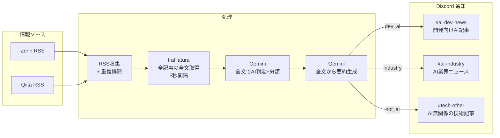

# RSS記事収集・分類・通知システム - 設計書

## システム概要

ZennとQiitaのRSSフィードから記事を収集し、AI関連かどうかを判定・分類し、Discord経由で通知するシステム。

---

## アーキテクチャ



### 設計方針: 全記事の全文取得

全記事をスクレイピングしてから全文ベースで分類する方式を採用している。タイトル＋RSS概要だけで先に分類する方式（スクレイピング対象を減らせる）も検討したが、概要は導入部分のみで分類精度が低くなるため、全文取得を優先した。スクレイピング時間は増えるが、正確な分類の方が重要と判断した。

---

## 1. RSSフィード収集モジュール (`src/rss_collector.py`)

### 1.1 対象フィード

- **Zenn**: `https://zenn.dev/feed`（トレンド記事、デフォルト20件）
- **Qiita**: `https://qiita.com/popular-items/feed.atom`（人気記事）

トピック/タグ指定なし。AI関連かどうかの判定はGeminiに任せる。

### 1.2 処理内容

- ライブラリ: `feedparser`
- 対象フィードをパースし、各記事のタイトル、URL、概要、出典を抽出
- 過去24時間以内の記事をフィルタリング

### 1.3 24時間以内判定

**基準時刻**: ワークフロー実行時刻（UTC）から24時間前

**判定フィールドの優先順位**:
1. `updated_parsed` が存在 → これを使用
2. `updated_parsed` が無い場合 → `published_parsed` を使用
3. 両方とも無い場合 → その記事を含める（取りこぼし防止）

### 1.4 重複排除メカニズム

**キャッシュファイル構造**:

```json
{
  "articles": [
    {
      "url": "https://zenn.dev/example/articles/abc123",
      "processed_at": "2026-02-11T22:30:15Z"
    }
  ]
}
```

**処理フロー**:

1. ワークフロー開始時に `.cache/processed_urls.json` を復元
2. 取得した記事URLと照合し、未処理の記事のみを後続に渡す
3. 処理完了後、新しいURLを追加して保存
4. 30日以上古いURLは自動削除

**URL正規化**:

同一記事の異なるURLパターンを統一：
- クエリパラメータ（`?utm_source=...`）を削除
- フラグメント（`#section`）を削除
- 末尾スラッシュを削除

**GitHub Actions Cache統合**:

```yaml
- uses: actions/cache@v4
  with:
    path: .cache/processed_urls.json
    key: processed-articles-${{ github.run_id }}
    restore-keys: |
      processed-articles-
```

---

## 2. 本文取得モジュール (`src/scraper.py`)

### 2.1 処理内容

**対象**: RSS収集で取得した全記事

**理由**: 
- RSS概要は導入部分のみで、AI判定や要約には不十分
- 記事の核心（実装方法、結論、学び）は本文にある
- 全文を読まないと正確な分類ができない

**処理**:

- ライブラリ: `trafilatura`
- 各記事のURLから本文を抽出
- リクエスト間隔: 5秒（robots.txt配慮）
- 抽出成功判定: 100文字以上
- 失敗時: `content = None` として次の処理に渡す

### 2.2 robots.txt配慮

- Zenn: `/search` のみ Disallow（記事ページはOK）
- Qiita: `/api/*`, `/search` のみ Disallow（記事ページはOK）
- 両サイトとも `Crawl-delay` 指定なし → 5秒間隔で安全

### 2.3 抽出失敗時の対応

- `content = None` の場合 → タイトル+RSS概要で分類・要約を試みる
- 完全に処理できない場合はスキップ

---

## 3. AI分類 + 要約モジュール (`src/classifier.py`)

### 3.1 使用モデル

**Gemini 2.5 Flash（無料枠）**

- ライブラリ: `litellm`（複数プロバイダー対応）
- Free Tier（Gemini使用時）: 10 RPM / 250 RPD / 250,000 TPM
- 想定使用量: 分類で1-3回 + 要約で25-30回 = **1日最大33回**

### 3.2 Step 1: AI判定 + カテゴリ分類（全文ベース）

**入力**: 記事全文（タイトル + 本文）

**処理**:
- バッチサイズ: 5-10件/リクエスト
- 本文は全文をそのまま渡す（切り詰めない）

**分類結果**:
- `dev_ai`: 開発に活かせるAIツール・API・実装テクニック・プロンプト手法
- `industry`: AI業界の動向・新モデル発表・研究論文・規制動向
- `not_ai`: AI無関係だが技術的に興味深い記事

**レスポンス形式（JSON）**:

```json
[
  {"url": "https://zenn.dev/...", "category": "dev_ai"},
  {"url": "https://qiita.com/...", "category": "industry"},
  {"url": "https://zenn.dev/...", "category": "not_ai"}
]
```

**処理**:

- バッチサイズ: 5-10件/リクエスト
- 本文は全文をそのまま渡す（大半の記事は5,000文字前後で問題ない。長い記事でTPM制限に達した場合は429リトライで対応）
- Temperature: 0.1（安定した分類のため低温度）
- レート制限対策: 6秒スリープ（Gemini無料枠 10 RPM対応）

### 3.3 Step 2: 要約生成（全文ベース）

**入力**: 記事全文（タイトル + 本文）

**要約長**: 最大400文字（全カテゴリ共通）

**処理**:

- 本文は全文をそのまま渡す（切り詰めによる要約精度低下を防ぐ。TPM制限超過時は429リトライで対応）
- Temperature: 0.3
- 要約長: 2-3行、最大400文字
- レート制限対策: 6秒スリープ（10 RPM対応）、429エラー時はリトライ（最大3回）

---

## 4. Discord通知モジュール (`src/notifier.py`)

### 4.1 チャンネル構成

| チャンネル | Webhook環境変数 | 送信内容 | 色 |
|-----------|----------------|---------|-----|
| `#ai-dev-news` | `DISCORD_WEBHOOK_DEV_AI` | 開発向けAI記事 | 緑 `0x00FF00` |
| `#ai-industry` | `DISCORD_WEBHOOK_AI_NEWS` | AI業界ニュース | 青 `0x0088FF` |
| `#tech-other` | `DISCORD_WEBHOOK_OTHER` | AI無関係の技術記事 | グレー `0x808080` |
| `#bot-log` | `DISCORD_WEBHOOK_BOT_LOG` | 実行結果サマリー・エラー通知 | — |

### 4.2 Embed設計

**#ai-dev-news（緑）**:

```python
{
    "title": "記事タイトル（最大200文字）",
    "url": "https://zenn.dev/...",
    "description": "要約（最大400文字）",
    "color": 0x00FF00,
    "fields": [
        {
            "name": "出典",
            "value": "Zenn",
            "inline": True
        }
    ]
}
```

**#ai-industry（青）**:

```python
{
    "title": "記事タイトル（最大200文字）",
    "url": "https://qiita.com/...",
    "description": "要約（最大400文字）",
    "color": 0x0088FF,
    "fields": [
        {
            "name": "出典",
            "value": "Qiita",
            "inline": True
        }
    ]
}
```

**#tech-other（グレー）**:

```python
{
    "title": "記事タイトル（最大200文字）",
    "url": "https://zenn.dev/...",
    "description": "要約（最大400文字）",
    "color": 0x808080,
    "fields": [
        {
            "name": "出典",
            "value": "Zenn",
            "inline": True
        }
    ]
}
```

### 4.3 実装方針

**送信処理**:
- ライブラリ: `requests`
- 1メッセージ1記事（Embedを1つだけ含む）
- タイトル: 最大200文字（超過時は切り詰め）
- 要約: 最大400文字（超過時は切り詰め）

**レート制限対応**:
- 各メッセージ送信後に1秒スリープ
- 429エラー時は`Retry-After`ヘッダーを参照してリトライ（最大3回）

---

## 5. メインフロー (`src/main.py`)

### 処理ステップ

1. **RSS収集 + 重複排除**
   - ZennとQiitaのRSSフィードを取得
   - 処理済みURLキャッシュと照合し、新規記事のみを抽出

2. **全文取得**
   - 全記事のURLから本文を取得（5秒間隔）
   - 取得失敗時は `content = None` として継続

3. **AI判定 + 分類**
   - 全文ベースでGeminiに分類を依頼
   - バッチ処理（5-10件ずつ）

4. **要約生成**
   - 各記事ごとにGeminiで要約を生成
   - 2-3行、最大400文字

5. **Discord通知**
   - カテゴリごとに3つのチャンネルに送信
   - Embed形式（1メッセージ1記事）

6. **実行結果サマリーを `#bot-log` に送信**
   - 処理件数・成功数・失敗数・各チャンネルへの通知件数
   - 失敗があれば対象URLと失敗理由を記載

7. **処理済みURL保存**
   - キャッシュファイルを更新（30日以上古いURLは削除）

### ログ出力

各ステップで進捗をログ出力：
- 新規記事数
- 本文取得成功数
- 分類結果の内訳
- Discord通知件数

---

## 6. 実行基盤

**GitHub Actions**

- 実行頻度: 1日1回（JST 07:00）
- 実行環境: ubuntu-latest
- Python: 3.12
- タイムアウト: 10分
- キャッシュ: 処理済みURL（GitHub Actions Cache使用）

**必要な環境変数**:
- `GEMINI_API_KEY`
- `DISCORD_WEBHOOK_DEV_AI`
- `DISCORD_WEBHOOK_AI_NEWS`
- `DISCORD_WEBHOOK_OTHER`
- `DISCORD_WEBHOOK_BOT_LOG`

**使用ライブラリ**:
- `feedparser` - RSS解析
- `litellm` - LLM API（Gemini/OpenAI/Claude等を統一インターフェースで利用）
- `trafilatura` - 本文抽出
- `requests` - HTTP通信
- `python-dotenv` - `.env` ファイルから環境変数を読み込み

---

## 7. エラーハンドリング

### 7.1 リトライ戦略

| 処理 | リトライ回数 | Backoff | 最終失敗時の対応 |
|-----|------------|---------|----------------|
| trafilatura（本文取得） | 0回 | なし | 概要で分類・要約を試みる |
| Gemini（分類） | 3回 | Exponential | バッチをスキップ |
| Gemini（要約） | 3回 | Exponential | その記事のみスキップ |
| Discord Webhook | 3回 | Retry-After | ログ出力のみ |

### 7.2 終了コード

- **exit 0（正常終了）**: 処理完了（一部記事のスキップを含む）
- **exit 1（異常終了）**: 致命的エラー（環境変数未設定、全記事処理不可など）

部分失敗（本文取得失敗、一部記事の要約失敗など）は正常終了として扱い、ログに WARNING を残す。致命的エラーのみ異常終了とし、Discord に失敗通知を送る（GitHub Actions 側で制御）。

### 7.3 ログ出力

Python標準の `logging` モジュールを使用：

- **INFO**: 正常な処理の進捗（記事数、分類結果、通知数）
- **WARNING**: 非致命的なエラー（本文取得失敗、API一時失敗）
- **ERROR**: 致命的なエラー（環境変数未設定、全API失敗）

---

## 8. テスト方針

**ライブラリ**: `pytest`（開発依存として追加）

**テスト対象**（外部通信を伴わないロジック）:
- URL正規化（クエリパラメータ除去、フラグメント除去、末尾スラッシュ除去）
- キャッシュの読み込み・保存・古いエントリの削除
- 24時間以内フィルタリングの日時判定
- Embed構築（タイトル切り詰め、色の割り当て、バッチ分割）
- LLMレスポンスのJSONパース（コードブロック除去含む）

**テスト対象外**（外部通信に依存するもの）:
- RSSフィード取得、スクレイピング、LLM API呼び出し、Discord送信

**実行方法**: `uv run pytest`

---

## 9. フォルダ構成

```
news/
├── src/              # ソースコード
├── .cache/           # キャッシュ（処理済みURL）
├── .github/          # GitHub設定
│   └── workflows/    # GitHub Actions定義
└── docs/             # ドキュメント
```

### 各フォルダの役割

- **`src/`** - Pythonソースコード（メイン処理、モジュール）
- **`.cache/`** - 処理済みURL保存（GitHub Actions Cacheで永続化）
- **`.github/workflows/`** - GitHub Actions自動実行設定
- **`docs/`** - 要件定義書、設計書などのドキュメント

---

## 9. 処理時間見積もり

想定: 全25-30件の記事

- RSS収集 + 重複排除: ~5秒
- 全文取得（全30件 x 5秒）: ~150秒（2.5分）
- Gemini 分類（3バッチ x 9秒（3秒応答 + 6秒スリープ））: ~27秒
- Gemini 要約（30件 x 9秒（3秒応答 + 6秒スリープ））: ~270秒（4.5分）
- Discord送信（3チャンネル）: ~15秒

**合計: 約8分**（タイムアウト10分以内）

---

## 10. 次のステップ（X機能追加時）

RSS機能が安定稼働したら、以下を追加予定：

- Xトレンド検索（Grok + x_search）
- Xアカウントウォッチ
- 2つの追加Discordチャンネル（#ai-x-trend, #ai-x-watch）
